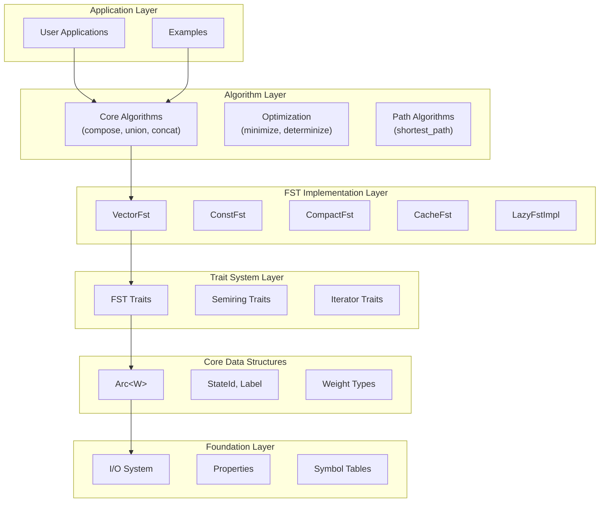

# System Architecture

ArcWeight employs a stratified architecture based on mathematical abstractions and software engineering principles. The design separates concerns into distinct layers while preserving composability and type safety.

## Architectural Overview

The architecture follows a layered design where each layer has specific responsibilities:



## Layer Responsibilities

**Application Layer** provides concrete implementations and examples.

**Algorithm Layer** implements core FST operations and algorithms following formal automata theory.
- **API Reference**: [`algorithms`](https://docs.rs/arcweight/latest/arcweight/algorithms/)

**FST Implementation Layer** provides different storage strategies optimized for different use cases.
- **API Reference**: [`fst`](https://docs.rs/arcweight/latest/arcweight/fst/)

**Trait System Layer** defines interfaces and mathematical abstractions.
- **API Reference**: [`fst::traits`](https://docs.rs/arcweight/latest/arcweight/fst/traits/)

**Core Data Structures** provide fundamental building blocks.
- **API Reference**: [`arc`](https://docs.rs/arcweight/latest/arcweight/arc/)

**Foundation Layer** handles system-level concerns.
- **API Reference**: [`io`](https://docs.rs/arcweight/latest/arcweight/io/), [`properties`](https://docs.rs/arcweight/latest/arcweight/properties/)

## Property System

The property system tracks FST characteristics for optimization:

```rust,ignore
bitflags! {
    pub struct PropertyFlags: u64 {
        const ACCEPTOR        = 1 << 0;   // Input = output labels
        const NO_EPSILONS     = 1 << 1;   // No epsilon transitions
        const EPSILONS        = 1 << 2;   // Has epsilon transitions
        const INPUT_DETERMINISTIC = 1 << 7;   // At most one arc per (state, input)
        const FUNCTIONAL      = 1 << 9;   // At most one output per input
        const ACCESSIBLE      = 1 << 11;  // All states reachable from start
        const COACCESSIBLE    = 1 << 12;  // All states can reach final states
        const CONNECTED       = 1 << 13;  // Both accessible and coaccessible
        const ACYCLIC         = 1 << 15;  // No cycles
        const TOP_SORTED      = 1 << 17;  // Topologically sorted
        const WEIGHTED        = 1 << 20;  // Non-trivial weights
        const STRING          = 1 << 22;  // Linear path (no branching)
    }
}
```

### Property-Based Optimization

Properties enable systematic optimization through:

1. **Algorithm Selection**: Different algorithms based on structural properties (e.g., acyclic vs. cyclic FSTs)
2. **Computational Pruning**: Avoiding redundant operations when preconditions are satisfied
3. **Specialized Implementations**: Optimized code paths for specific FST characteristics

```rust,ignore
// Example: Topological vs. general shortest distance
if fst.properties().contains(PropertyFlags::ACYCLIC) {
    topological_shortest_distance(fst)  // O(|V| + |E|)
} else {
    bellman_ford_shortest_distance(fst)  // O(|V| × |E|)
}
```

## I/O Architecture

The I/O system supports multiple serialization formats:

### Text Format
```rust,ignore
pub fn read_text<M, W>(
    reader: &mut impl BufRead,
    input_symbols: Option<&SymbolTable>,
    output_symbols: Option<&SymbolTable>,
) -> Result<M>

pub fn write_text<F, W>(
    fst: &F,
    writer: &mut impl Write,
    input_symbols: Option<&SymbolTable>,
    output_symbols: Option<&SymbolTable>,
) -> Result<()>
```

### OpenFST Compatibility
```rust,ignore
pub fn read_openfst<M, W>(reader: &mut impl Read) -> Result<M>
pub fn write_openfst<F, W>(fst: &F, writer: &mut impl Write) -> Result<()>
```

### Native Binary Format
```rust,ignore
#[cfg(feature = "serde")]
pub fn read_binary<M, W>(reader: &mut impl Read) -> Result<M>
pub fn write_binary<F, W>(fst: &F, writer: &mut impl Write) -> Result<()>
```

## Symbol Table Integration

```rust,ignore
pub struct SymbolTable {
    symbol_to_id: HashMap<String, Label>,
    id_to_symbol: Vec<String>,
    epsilon_id: Label,
    next_id: Label,
}
```

### Symbol Table Design

The symbol table provides efficient string-to-integer mapping with the following characteristics:

1. **Bidirectional Mapping**: O(1) lookup in both directions using HashMap and Vec
2. **Memory Efficiency**: Strings stored once, referenced by integer ID
3. **Epsilon Handling**: Reserved ID 0 for epsilon transitions
4. **Thread Safety**: Immutable after construction for concurrent access

```rust,ignore
// Example usage
let mut table = SymbolTable::new();
let id = table.add_symbol("hello".to_string());  // Returns Label
let symbol = table.get_symbol(id);                // Returns Option<&str>
```

## Error Handling

```rust,ignore
#[derive(Debug, thiserror::Error)]
pub enum Error {
    #[error("Invalid FST operation: {0}")]
    InvalidOperation(String),

    #[error("I/O error: {0}")]
    Io(#[from] std::io::Error),

    #[error("Serialization error: {0}")]
    Serialization(String),

    #[error("Algorithm error: {0}")]
    Algorithm(String),
}

pub type Result<T> = std::result::Result<T, Error>;
```

### Error Handling Strategy

The error handling system follows Rust idioms and provides:

1. **Structured Error Types**: Enumerated error categories with detailed context
2. **Automatic Conversion**: From standard library errors using `#[from]` attribute
3. **Recoverable Errors**: All operations return `Result<T, Error>` for explicit error handling
4. **Error Propagation**: Seamless error propagation through `?` operator

```rust,ignore
// Example error handling
fn process_fst<F, W>(fst: &F) -> Result<VectorFst<W>>
where
    F: Fst<W>,
    W: Semiring,
{
    let result = some_operation(fst)?;  // Auto-propagates errors
    Ok(result)
}
```