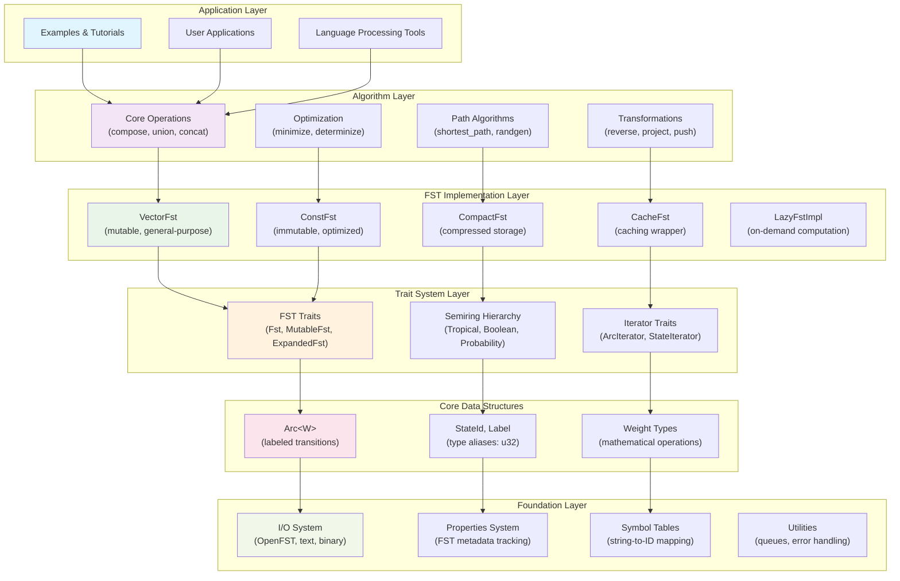

# System Architecture

ArcWeight is built around a **trait-based, modular architecture** that separates concerns across several key dimensions. This layered design enables both flexibility and performance while maintaining mathematical correctness and type safety.

## Architectural Overview

The architecture follows a clean layered design where each layer has specific responsibilities and clear interfaces:



## Layer Responsibilities

**Application Layer** provides concrete implementations and examples:
- Real-world applications like spell checking, morphological analysis
- Educational examples demonstrating FST concepts
- Integration points for larger NLP systems

**Algorithm Layer** implements core FST operations and algorithms:
- Mathematical operations following formal automata theory
- Optimization algorithms for performance and correctness
- Specialized algorithms for different problem domains
- **API Reference**: [`algorithms`](https://docs.rs/arcweight/latest/arcweight/algorithms/)

**FST Implementation Layer** provides different storage strategies:
- Multiple implementations optimized for different use cases
- Trade-offs between memory usage, access speed, and mutability
- Transparent interface allowing algorithm reuse across implementations
- **API Reference**: [`fst`](https://docs.rs/arcweight/latest/arcweight/fst/)

**Trait System Layer** defines interfaces and mathematical abstractions:
- Clean separation between interface and implementation
- Type safety through Rust's trait system
- Mathematical correctness through semiring abstractions
- **API Reference**: [`fst::traits`](https://docs.rs/arcweight/latest/arcweight/fst/traits/) and [`semiring::traits`](https://docs.rs/arcweight/latest/arcweight/semiring/traits/)

**Core Data Structures** provide fundamental building blocks:
- Efficient representation of FST components
- Type-safe operations with compile-time guarantees
- Zero-cost abstractions for performance
- **API Reference**: [`arc`](https://docs.rs/arcweight/latest/arcweight/arc/)

**Foundation Layer** handles system-level concerns:
- Interoperability with other FST libraries
- Efficient I/O and serialization
- Utility functions and error handling
- **API Reference**: [`io`](https://docs.rs/arcweight/latest/arcweight/io/), [`properties`](https://docs.rs/arcweight/latest/arcweight/properties/), [`utils`](https://docs.rs/arcweight/latest/arcweight/utils/)

## Advanced Architecture Concepts

### Property System

**API Reference**: [`properties`](https://docs.rs/arcweight/latest/arcweight/properties/)

The property system tracks FST characteristics for optimization:

```rust,ignore
bitflags! {
    pub struct PropertyFlags: u64 {
        const ACCEPTOR        = 1 << 0;   // Input = output labels
        const NO_EPSILONS     = 1 << 1;   // No epsilon transitions
        const EPSILONS        = 1 << 2;   // Has epsilon transitions
        const INPUT_DETERMINISTIC = 1 << 7;   // At most one arc per (state, input)
        const FUNCTIONAL      = 1 << 9;   // At most one output per input
        const ACCESSIBLE      = 1 << 11;  // All states reachable from start
        const COACCESSIBLE    = 1 << 12;  // All states can reach final states
        const CONNECTED       = 1 << 13;  // Both accessible and coaccessible
        const ACYCLIC         = 1 << 15;  // No cycles
        const TOP_SORTED      = 1 << 17;  // Topologically sorted
        const WEIGHTED        = 1 << 20;  // Non-trivial weights
        const STRING          = 1 << 22;  // Linear path (no branching)
        // ... additional properties
    }
}

pub struct FstProperties {
    pub known: PropertyFlags,      // Properties that have been computed
    pub properties: PropertyFlags, // Property values
}
```

**Benefits:**
- **Algorithm optimization** based on FST characteristics
- **Avoid redundant computation** if properties already known
- **Enable specialized algorithms** for specific FST types

### I/O Architecture

**API Reference**: [`io`](https://docs.rs/arcweight/latest/arcweight/io/)

The I/O system supports multiple serialization formats:

#### Text Format
```rust,ignore
pub fn read_text<M, W>(
    reader: &mut impl BufRead,
    input_symbols: Option<&SymbolTable>,
    output_symbols: Option<&SymbolTable>,
) -> Result<M>

pub fn write_text<F, W>(
    fst: &F,
    writer: &mut impl Write,
    input_symbols: Option<&SymbolTable>,
    output_symbols: Option<&SymbolTable>,
) -> Result<()>
```

#### OpenFST Compatibility
```rust,ignore
pub fn read_openfst<M, W>(reader: &mut impl Read) -> Result<M>
where
    M: MutableFst<W> + Default,
    W: Semiring + FromStr,

pub fn write_openfst<F, W>(fst: &F, writer: &mut impl Write) -> Result<()>
where
    F: Fst<W>,
    W: Semiring + Display,
```

#### Native Binary Format
```rust,ignore
#[cfg(feature = "serde")]
pub fn read_binary<M, W>(reader: &mut impl Read) -> Result<M>
where
    M: MutableFst<W> + Default + for<'de> Deserialize<'de>,
    W: Semiring + for<'de> Deserialize<'de>,

#[cfg(feature = "serde")]
pub fn write_binary<F, W>(fst: &F, writer: &mut impl Write) -> Result<()>
where
    F: Fst<W> + Serialize,
    W: Semiring + Serialize,
```

### Symbol Table Integration

**API Reference**: [`SymbolTable`](https://docs.rs/arcweight/latest/arcweight/utils/struct.SymbolTable.html)

```rust,ignore
pub struct SymbolTable {
    symbol_to_id: HashMap<String, Label>,
    id_to_symbol: Vec<String>,
    epsilon_id: Label,
    next_id: Label,
}
```

**Features:**
- **Bidirectional mapping** between strings and numeric IDs (u32)
- **Memory efficiency** for repeated symbols
- **Epsilon handling** with reserved ID 0

### Error Handling Strategy

**API Reference**: [`Error`](https://docs.rs/arcweight/latest/arcweight/enum.Error.html)

```rust,ignore
#[derive(Debug, thiserror::Error)]
pub enum Error {
    /// Invalid FST operation
    #[error("Invalid FST operation: {0}")]
    InvalidOperation(String),

    /// I/O error
    #[error("I/O error: {0}")]
    Io(#[from] std::io::Error),

    /// Serialization error
    #[error("Serialization error: {0}")]
    Serialization(String),

    /// Algorithm-specific error
    #[error("Algorithm error: {0}")]
    Algorithm(String),
}

pub type Result<T> = std::result::Result<T, Error>;
```

**Design Benefits:**
- **Consistent error handling** across all operations
- **Structured error categories** for different failure modes
- **Automatic conversion** from standard library errors
- **Rich error context** through error messages